# Hotel Management System

A comprehensive hotel management system developed in Java to streamline hotel operations such as reservations, check-ins, check-outs, and room management.

 ## Features

- Room booking and reservation management
- Check-in and check-out processing
- Customer information management
- Room status tracking (available, occupied, maintenance)
- Billing and payment processing
- Reporting and analytics

## Technologies Used

- Programming Language: Java
- Database:  MySQL.
- IDE: Eclipse, IntelliJ IDEA
## Database Schema

The application uses a MySQL database with the following tables:

### 1. `customer`
Stores customer details.

| Field       | Type        | Null | Description                      |
|-------------|-------------|------|----------------------------------|
| document    | varchar(20) | YES  | Identification document type    |
| number      | varchar(20) | YES  | Identification document number  |
| name        | varchar(30) | YES  | Customer's name                 |
| gender      | varchar(15) | YES  | Gender of the customer          |
| country     | varchar(20) | YES  | Customer's country              |
| room        | varchar(10) | YES  | Room number allocated           |
| checkintime | varchar(80) | YES  | Check-in time                   |
| deposit     | varchar(20) | YES  | Initial deposit amount          |

---

### 2. `department`
Stores department-related data.

| Field      | Type        | Null | Description                     |
|------------|-------------|------|---------------------------------|
| department | varchar(30) | YES  | Department name                |
| budget     | varchar(30) | YES  | Budget allocated to department |

---

### 3. `driver`
Stores details of drivers associated with the hotel.

| Field    | Type        | Null | Description                        |
|----------|-------------|------|------------------------------------|
| name     | varchar(20) | YES  | Driver's name                     |
| age      | varchar(10) | YES  | Driver's age                      |
| gender   | varchar(15) | YES  | Gender of the driver              |
| company  | varchar(20) | YES  | Driver's company affiliation      |
| brand    | varchar(20) | YES  | Brand of vehicle                  |
| availabe | varchar(20) | YES  | Availability status of the driver |
| location | varchar(40) | YES  | Driver's current location         |

---

### 4. `employee`
Stores employee details.

| Field  | Type        | Null | Description                 |
|--------|-------------|------|-----------------------------|
| name   | varchar(25) | YES  | Employee's name            |
| age    | varchar(10) | YES  | Employee's age             |
| gender | varchar(15) | YES  | Gender of the employee     |
| job    | varchar(30) | YES  | Employee's job title       |
| salary | varchar(15) | YES  | Employee's salary          |
| phone  | varchar(15) | YES  | Employee's phone number    |
| email  | varchar(40) | YES  | Employee's email address   |
| aadhar | varchar(20) | YES  | Employee's Aadhar number   |

---

### 5. `login`
Stores login credentials for users.

| Field    | Type        | Null | Description       |
|----------|-------------|------|-------------------|
| username | varchar(25) | YES  | User's username   |
| password | varchar(25) | YES  | User's password   |

---

### 6. `room`
Stores information about hotel rooms.

| Field           | Type        | Null | Description                    |
|-----------------|-------------|------|--------------------------------|
| roomnumber      | varchar(10) | YES  | Room number                   |
| availability    | varchar(20) | YES  | Availability status of the room |
| cleaning_status | varchar(20) | YES  | Cleaning status of the room   |
| price           | varchar(20) | YES  | Price per night               |
| bed_type        | varchar(20) | YES  | Type of bed in the room       |

---

This schema provides an overview of how data is structured and stored in the application. Ensure that these tables are created in the database before running the application.

## Usage

### Access the Application:
- Open your web browser and navigate to `http://localhost:8080`.

### Login:
- Use the default admin credentials to log in:
  - **Username**: `admin`
  - **Password**: `admin123`

### Manage Operations:
- Use the dashboard to navigate through different functionalities such as:
  - Room Management
  - Reservations
  - Check-ins
  - Reports
  - Check-outs
  - Pickup Service
  - Search rooms
  - Add New Rooms
  - Add New Employee
  - Add Drivers

## Screenshots

#### Homepage
The main landing page for the Hotel Management System.
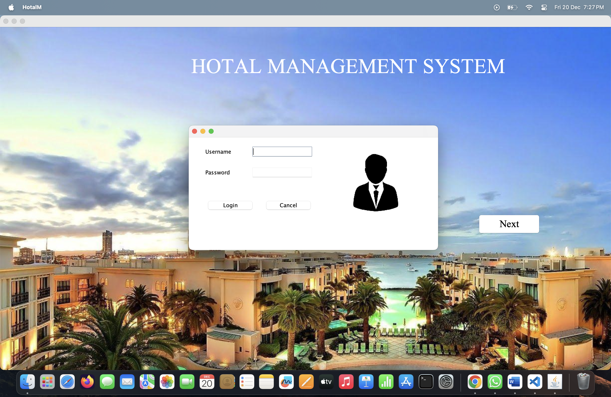

#### Dashboard
The central hub displaying key hotel operations and analytics.
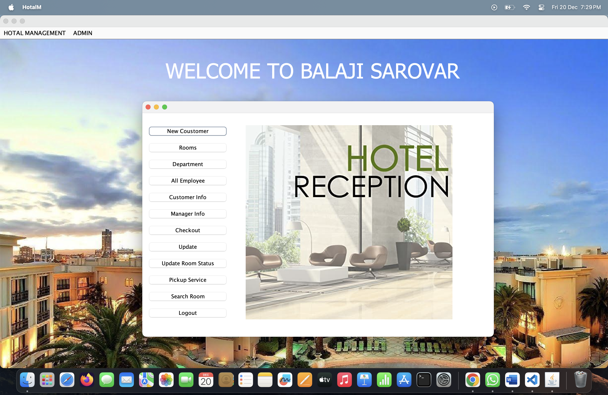

---

Below are screenshots of various features of the Hotel Management System:

### 1. Admin Features

#### Add Driver
Interface to add and manage driver details for the hotel services.
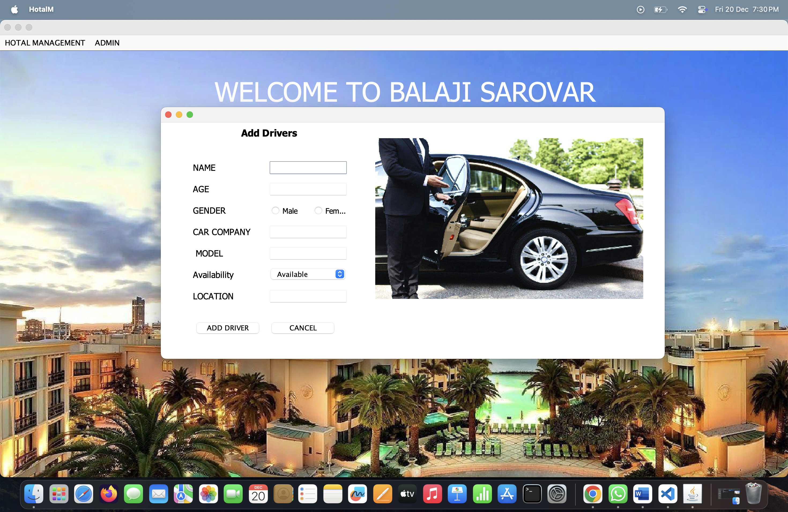

#### Add Employee
Screen to register and manage hotel staff information.
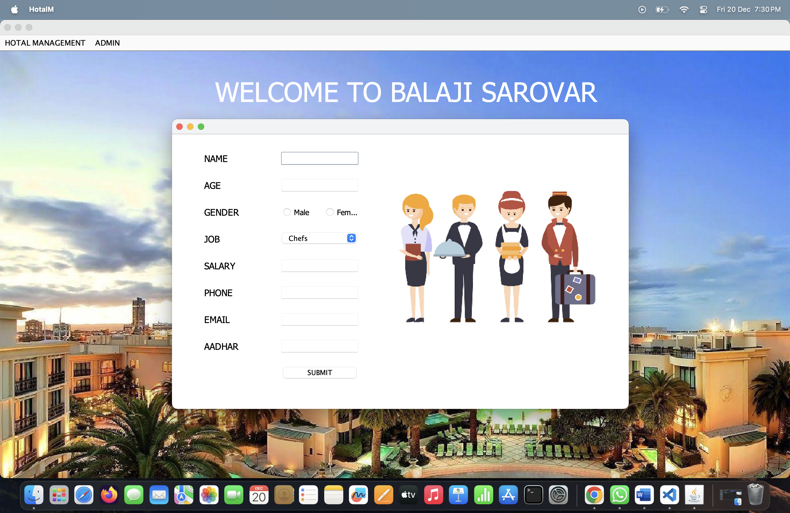

#### Add Room
Form to add new rooms with details like availability and pricing.
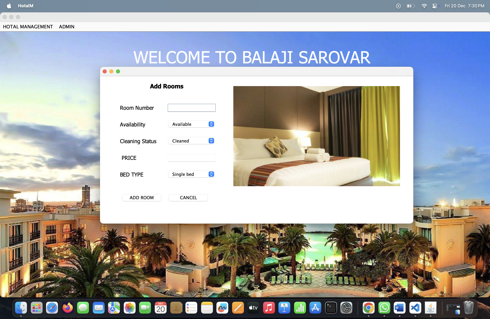

---

### 2. Customer Management

#### New Customer
Page to register a new customer and assign a room.
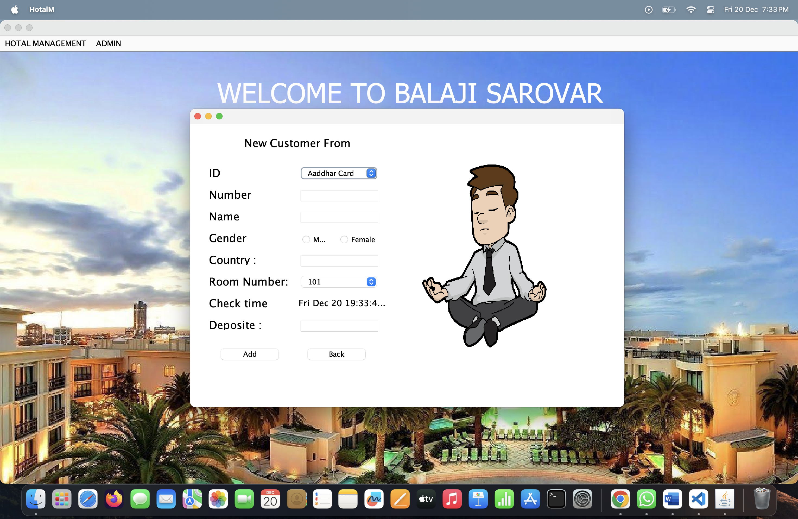

#### Customer Information
View detailed information about all current customers.
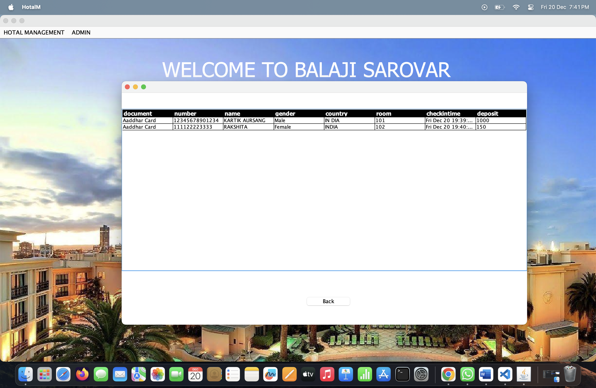

#### Checkout
Facilitates the customer checkout process and room clearance.
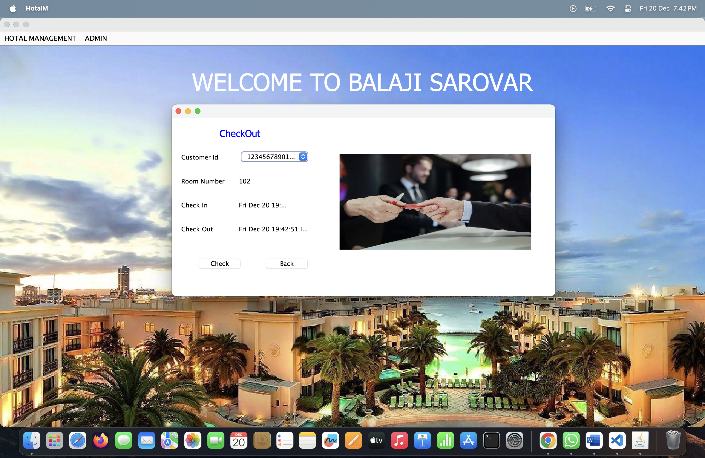

---

### 3. Room Management

#### Room Information
Displays details about all available and occupied rooms.
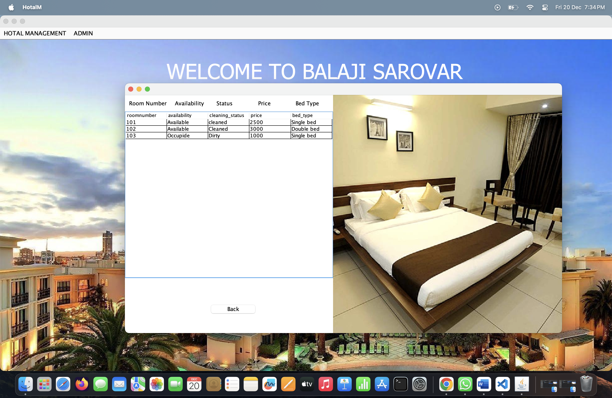

#### Search Room
Search functionality to find specific rooms based on criteria.
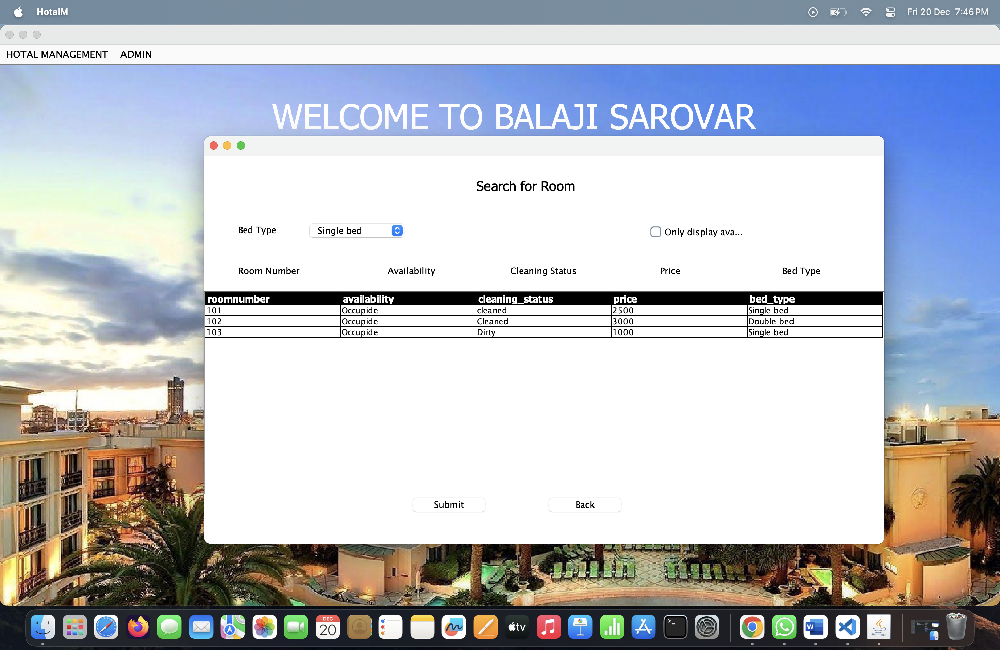

#### Update Room
Allows updating details of existing rooms such as status or pricing.
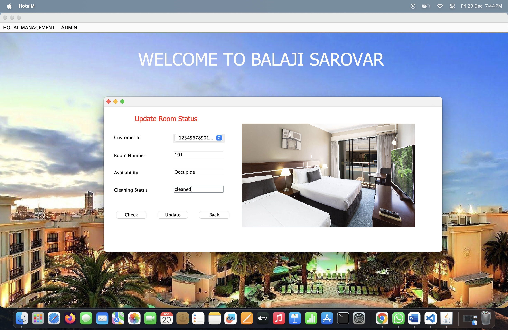

---

### 4. Employee and Department Management

#### Employee Information
List of all employees with their roles and contact information.

#### Department Information
Overview of various departments within the hotel and their budgets.
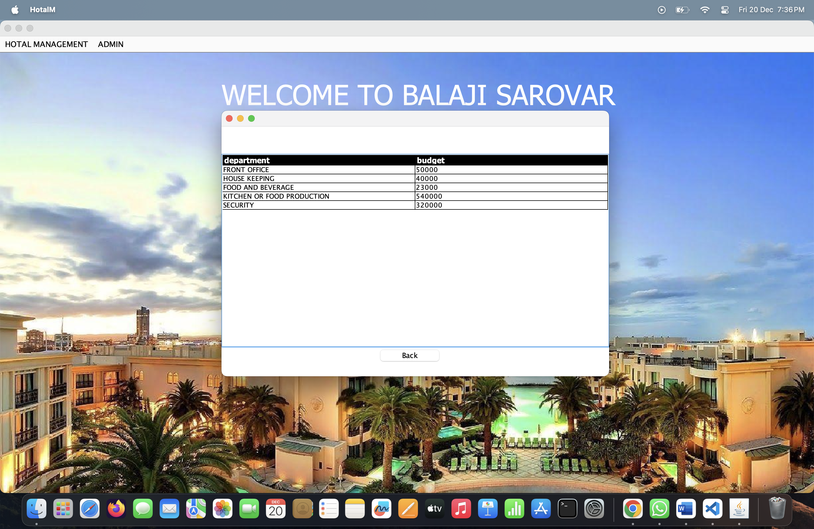

#### Manager Information
Displays details of managers responsible for hotel operations.

---

### 5. Additional Features

#### Pickup Service
Manage driver and vehicle availability for customer pickup services.
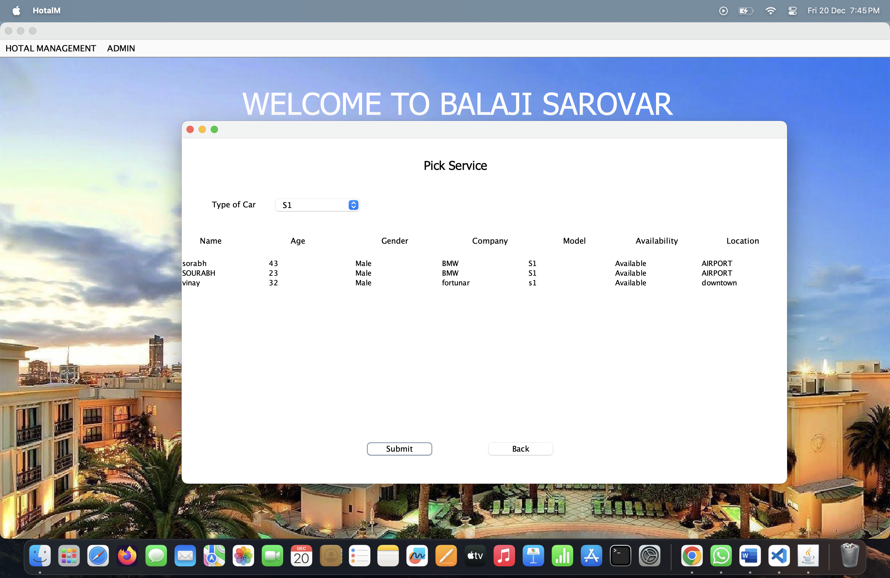

#### Update
Update miscellaneous records and operational details.
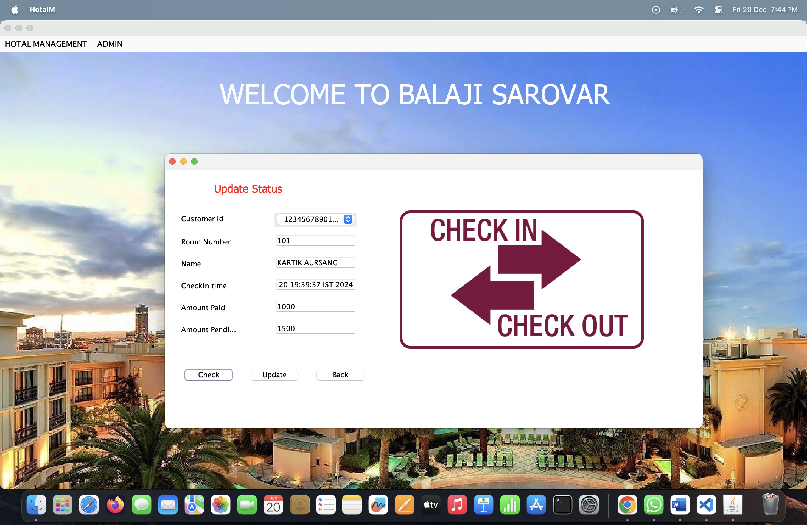

